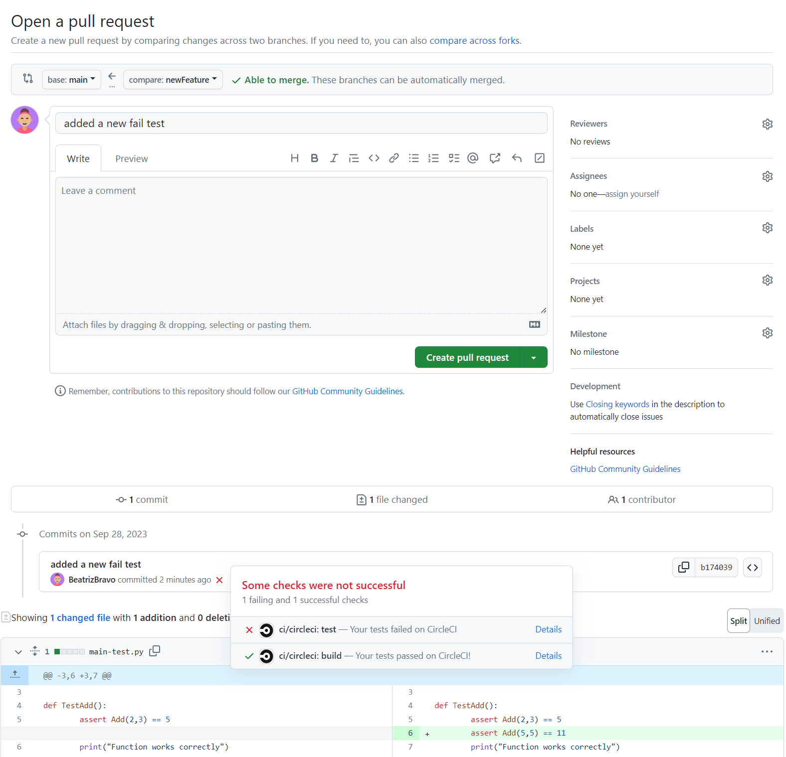

# circleci-test-python
There are two Python files, one contains a function, and one contains a test.  
CircleCI should detect the code changes and run our build_and_test workflow for our branch.  We should be able to see the jobs run on CircleCI's website.

# Failing a test

If we look at our **Pull Request**, 
we should see that the build step passes 
since the code is still functional, 
but now our test fails since 5+5 is not 11.   
So now we had know the code change being introduced 
by this **branch is harmful**, and we should not merge this 
branch (and CircleCI can use that info to stop other 
jobs, like making sure not to deploy if the tests fail).